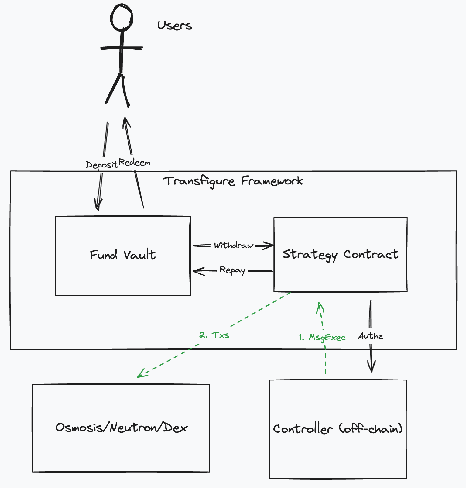

# Transfigure

This repo contains the code base for `Transfigure` a framework that enables non-custodial execution of sophisticated strategies.

To do this the framework is compromised of a `Fund Vault` and `Strategy Contract`. The fund vault simply holds funds and the strategy contract executes actions with said funds.

The objective of the `Fund Vault` and `Strategy` is to be able to execute sophisticated strategies on behalf of the users without becoming custodian of users funds. Therefore it leverages `authz` to enable an off-chain service to execute the strategy on behalf of the user. The contract allows profit's to be booked in multiple ways as defined and appropriate to a specific strategy.



Shown above is a high level diagram of the `Fund Vault` and `Strategy` contracts.

Fund vault is able to accept deposits from users and the `Strategy` contract is able to manage the deposits. Users are issued with a share token that represents their share of the vault token supply. Shares are minted according to the valuation of the deposit and vault at time of deposit. Redemptions are processed simply as a share of vault assets.

The fund vault is able to understand the valuation of the vault by storing withdrawn assets and being able to query the price of assets held at any time. The fund vault is not however able to understand the valuation of unrealised PnL. PnL is returned to the vault through repayment of withdrawn funds by the strategy contract.

The strategy contract is able to manage a balance sheet of inventory but is limited to performing actions for which is has permission to perform via `authz`. It withdraws funds from the fund vault and repays them when profit is realised.

## Contracts

| Contract          | Reference                            | Description                                                                                                                                         |
| ----------------- | ------------------------------------ | --------------------------------------------------------------------------------------------------------------------------------------------------- |
| Fund Vault        | [doc](./contracts/fund-vault)        | Fund vault manages the deposit and redemptions into a the vault, users receive a share denom based on the valuation of their deposits at that time. |
| Strategy Contract | [doc](./contracts/strategy-contract) | Strategy contract enables an off-chain component to execute commands using `authz` and is able ot manage the balance sheet of the strategy.         |

## Get started

### Environment Setup

#### Pre-Requisites

- Rust v1.78.\*
- `wasm32-unknown-unknown` target
- Docker

#### Instructions

- Install `rustup` via https://rustup.rs/
- Run the following:

```sh
rustup default stable
rustup target add wasm32-unknown-unknown
```

- Make sure [Docker](https://www.docker.com/) is installed

### Build

Clone this repository and build the source code:

```sh
git clone git@github.com:margined-protocol/strategy-contract.git
cd strategy-contract
cargo build
```

### Unit / Integration Tests

To run the tests after installing pre-requisites do the following:

Compile contracts:

```sh
./build_release.sh
```

Run the tests:

```sh
cargo test
```
