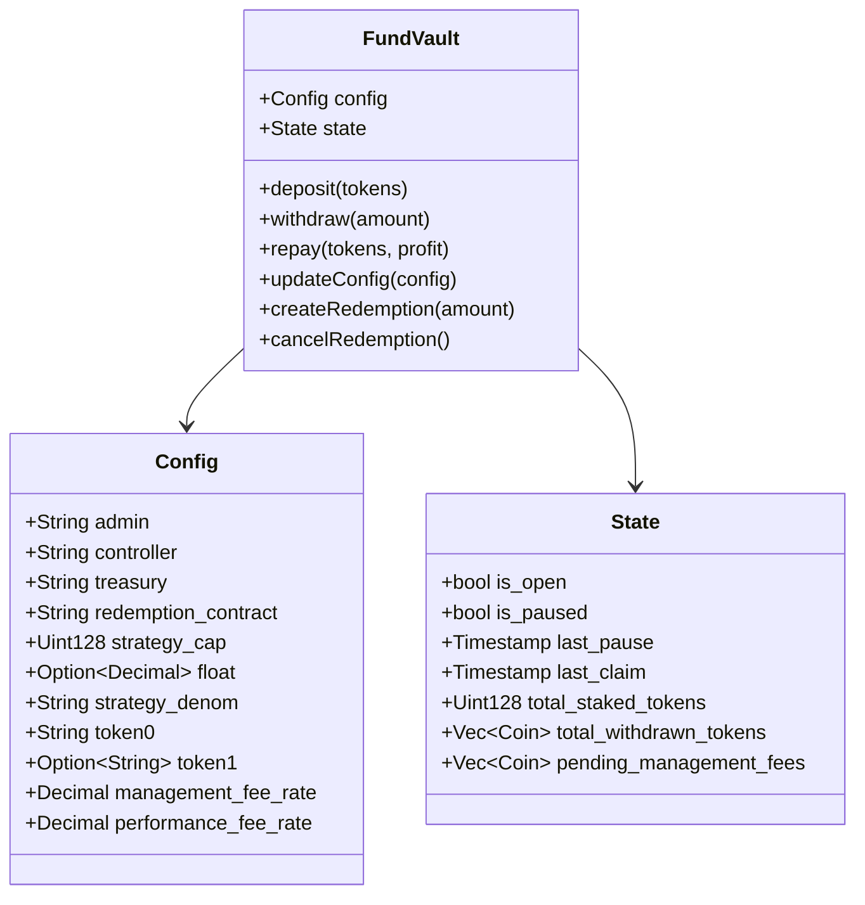
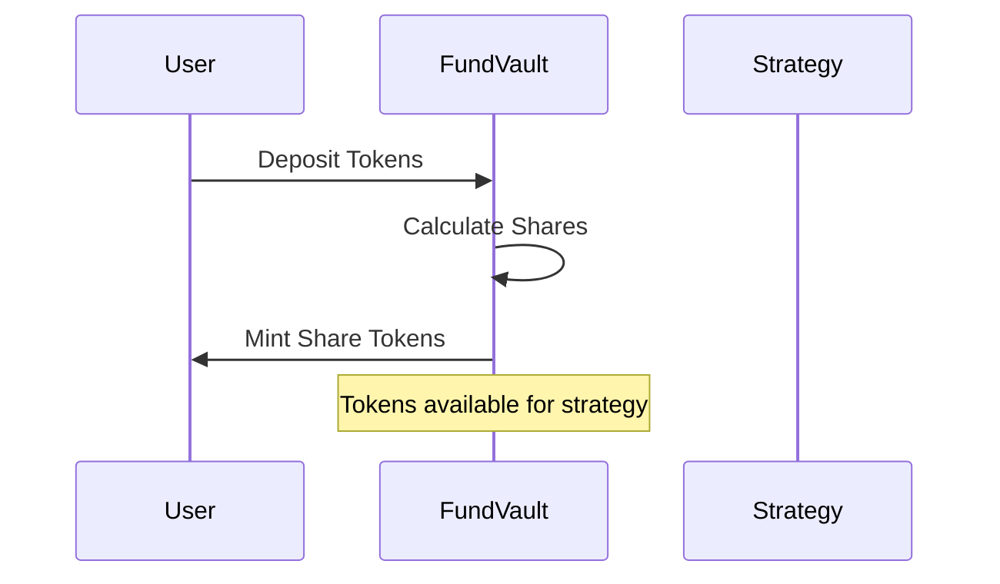
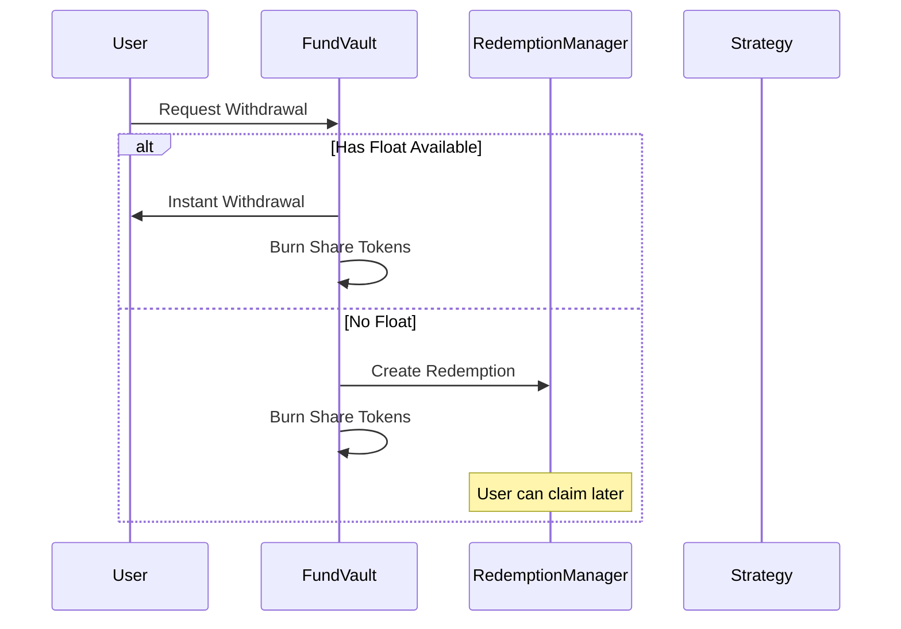

# Fund Vault

The fund vault manages deposits and redemptions into the vault. It supports deposit of single and multiple assets. It is managed by two accounts, the `admin` and `controller`.

## Architecture

## Flow Diagrams

### Deposit Flow

### Withdrawal Flow

## Key Components

The vault has several key components:

1. **Admin Role**

   - Manages vault configuration
   - Sets strategy cap
   - Controls float settings

2. **Controller Role**

   - Manages balance sheet
   - Withdraws and repays funds
   - Typically the strategy contract

3. **Float Mechanism**

   - Enables instant withdrawals
   - Limited by percentage of assets
   - Configurable by admin

4. **Fee Structure**
   - Management fees
   - Performance fees
   - Treasury collection

**NOTE:** All admin functionality for production vaults should be managed by a multisig wallet.
