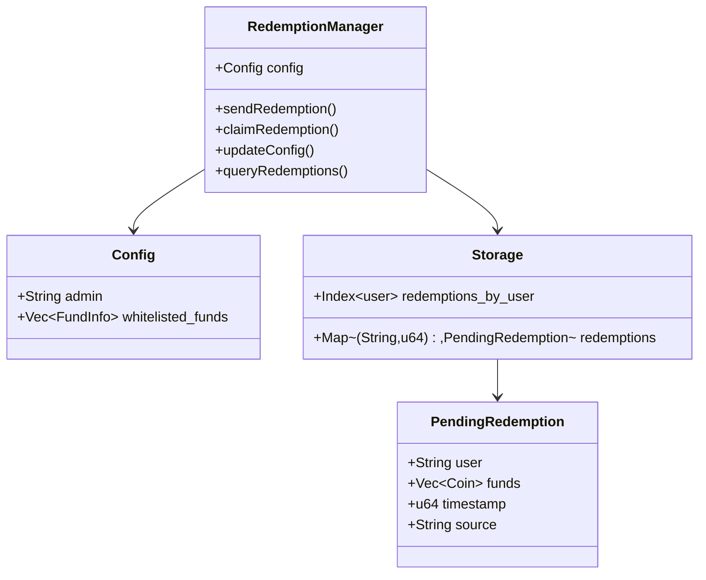
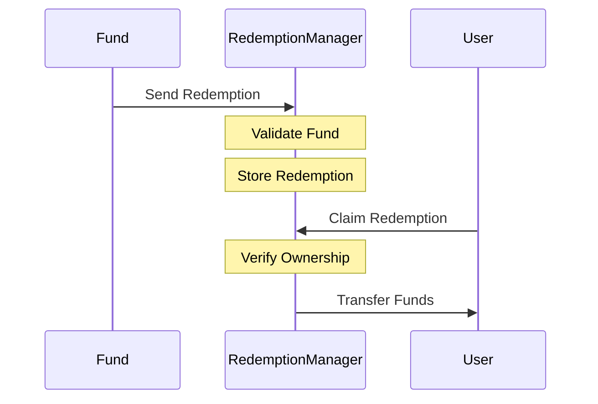
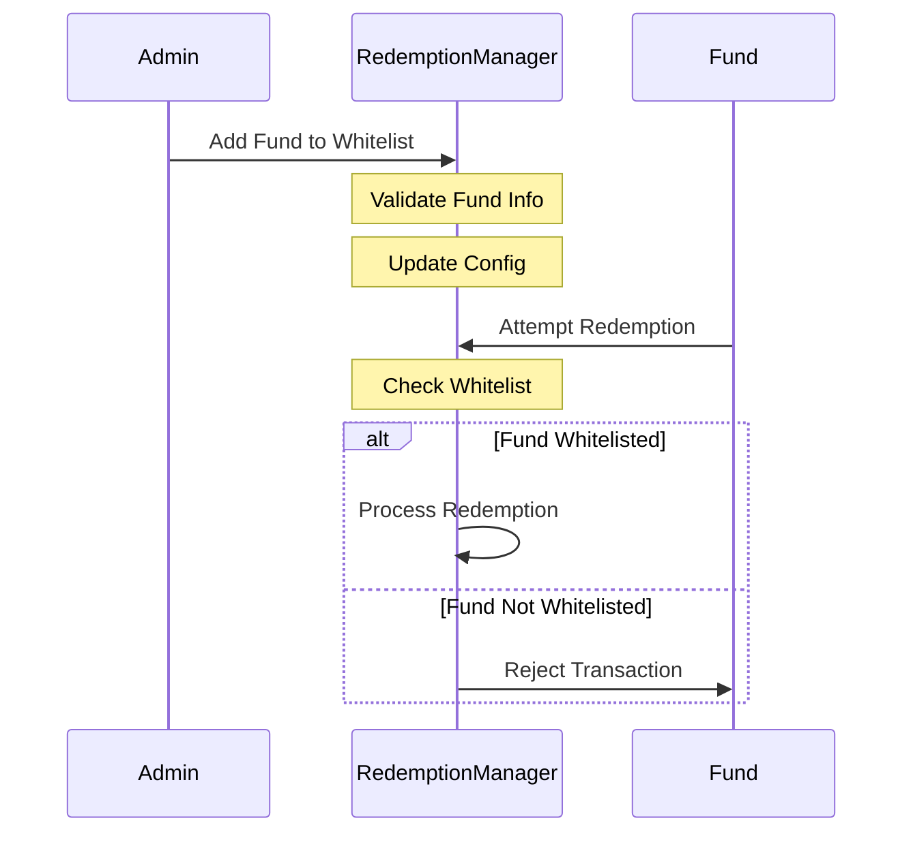

# Redemption Manager Contract

The redemption manager contract enables funds from processed redemptions to be held on behalf of a user until they are claimed.

## Architecture

## Flow Diagrams

### Redemption Process

### Fund Management

## Key Components

1. **Whitelisted Funds**

   - Maximum 100 funds
   - Admin controlled
   - Validated addresses

2. **Redemption Queue**

   - FIFO processing
   - User-specific tracking
   - Timestamp ordering

3. **Security Features**

   - Fund validation
   - User verification
   - Amount verification

4. **Admin Controls**
   - Fund whitelist management
   - Configuration updates
   - Emergency controls

**NOTE:** All admin functionality for production contracts should be managed by a multisig wallet.
