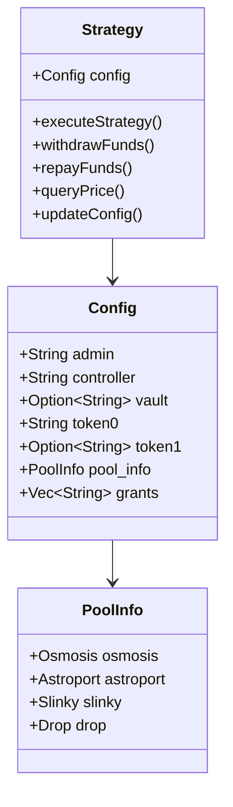
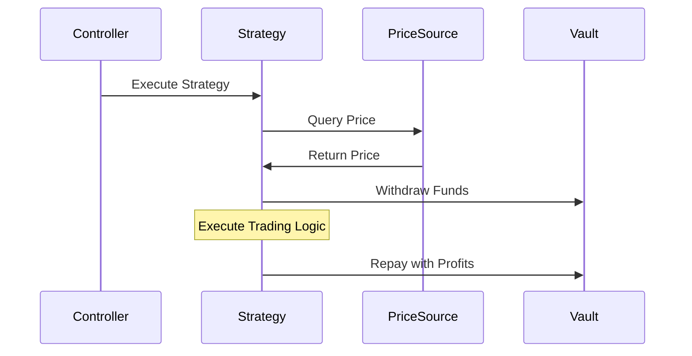
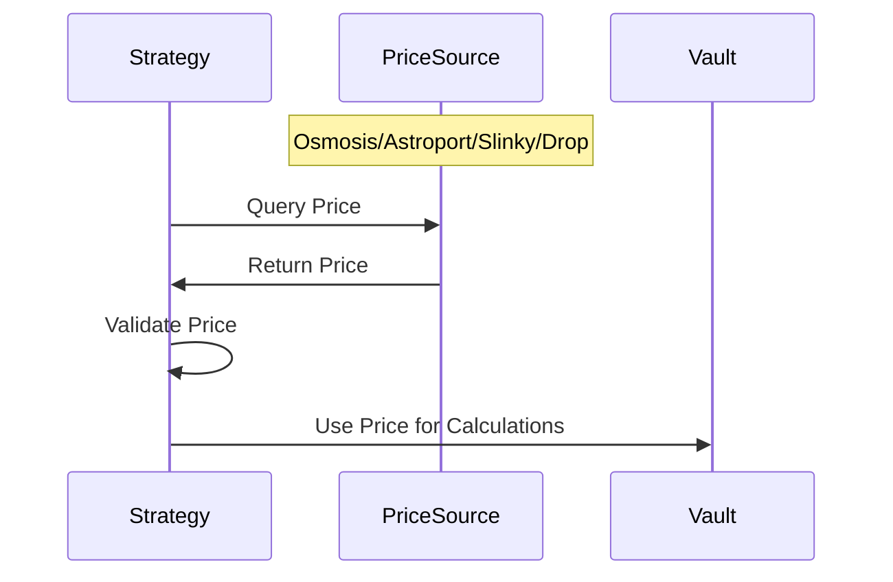

# Strategy Contract

The strategy contract manages a balance sheet of inventory and executes trading strategies through authorized actions via `authz`. It coordinates with the fund vault for withdrawals and repayments.

## Architecture

## Flow Diagrams

### Strategy Execution Flow

### Price Integration Flow

## Key Components

1. **Admin Management**

   - Configures strategy parameters
   - Manages grants
   - Controls price source settings

2. **Controller Functions**

   - Executes strategy operations
   - Manages fund withdrawals/repayments
   - Interacts with price sources

3. **Price Sources**

   - Osmosis TWAPs
   - Astroport Observations
   - Slinky Integration
   - Drop Protocol

4. **Authorization**
   - Uses `authz` for permissions
   - Limited to granted operations
   - Secure execution model

**NOTE:** All admin functionality for production contracts should be managed by a multisig wallet.
